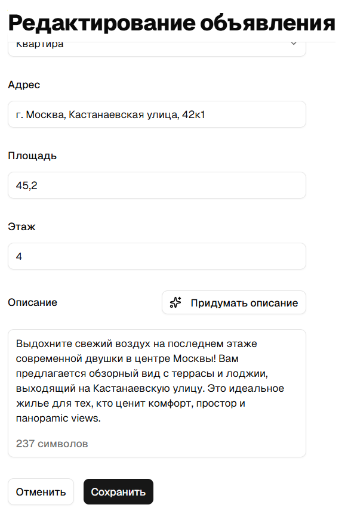

# Avito Test Task

Инструкции по локальному запуску фронтенда, бэкенда и локальной установки Ollama (LLM).

## Требования
- Node.js (16+), npm
- Ollama (для локального AI)

## Клонирование репозитория

```bash
git clone https://github.com/skufirovan/avito-test-task.git
cd avito-test-task
```

## Ollama
1. Установите Ollama: https://ollama.com
2. Загрузите модель:
   ```bash
   ollama pull llama3
   ```
3. Убедитесь, что Ollama запущена:
   ```bash
   ollama serve
   ```

## Backend
1. Перейти в папку `server` и установить зависимости:
   ```bash
   cd server
   npm install
   ```
2. Создать файл `.env` с переменными:
   ```
   APP_PORT=8080
   AI_MODEL="llama3"
   ```
3. Запустить:
   ```bash
   npm start
   ```

> Важно: AI_MODEL в server/.env должен соответствовать имени модели в Ollama (например `llama3`).

## Frontend
1. Перейти в папку `frontend` и установить зависимости:
   ```bash
   cd frontend
   npm install
   ```
2. Создать файл `.env` с переменной:
   ```
   VITE_API_URL=http://localhost:8080
   ```
3. Запустить:
   ```bash
   npm run dev
   ```

## Стек

Frontend
- React 19 + TypeScript
- Vite
- React Router
- Redux Toolkit + RTK Query
- React Hook Form + Zod
- TailwindCSS + shadcn/ui

## Архитектурные решения

Фильтры, поиск, сортировка и пагинация хранятся в query params. Это позволяет сохранять состояние при перезагрузке и делиться ссылкой с текущим состоянием

Реализован кастомный хук useAdsSearchParams для парсинга и нормализации query параметров

## Скриншоты

*Главный экран позволяет просматривать объявления, фильтровать по категориям и отмечать товары, требующие доработки.*


*Функция AI автоматически анализирует рынок и предлагает оптимальную цену — ниже, рыночную или выше рыночной.*


*Нейросеть помогает составить привлекательное описание для объявления на основе ключевых параметров объекта.*


